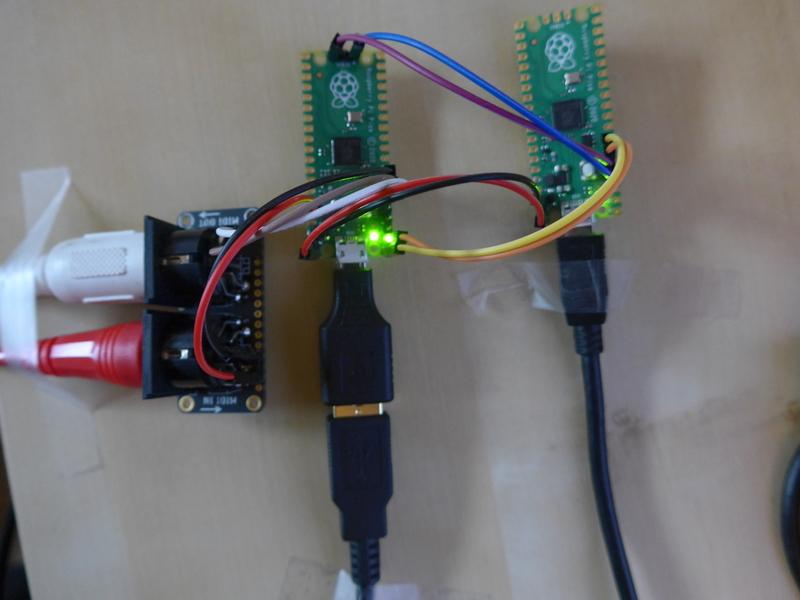

# midi2usbhost
Use a Raspbery Pi Pico to add old school MIDI IN and MIDI OUT to MIDI devices with a USB B device port.

# Disclaimers
This is a hardware and software project. The MIDI gadgets you will wire to
this hardware will likely cost a lot more than than the hardware for this project.
Please double-check my design and test your circuit and wiring
before you connect it to anything expensive. I will take no responsibility
for burning up your favorite keyboard or sound module.

This projects uses commercial hardware for testing. I do not officially
endorse any hardware. I have not been paid by anyone to use this hardware.
A carefully designed custom board would be a better solution. The hardware
combinations described here would almost certainly fail electrical and RF
compliance testing. Use at your own risk.

# Software
You may build one of two different programs in this project to bridge USB
Host MIDI to serial port MIDI depending on whether you prefer to work with
C Code or with an Arduino Sketch. Either program will run on the same
hardware. If you want to build and run the C Code, follow the instructions
in the [README.md](C-Code/README.md) file in the `C-Code` directory. If you want to build and
run the Arduino sketch, follow the instructions in the [README.md](arduino/midi2usbhost/README.md) file in
the `arduino` directory.

# Hardware Dependencies
This project is designed to run on the RP2040 chip. It is tested on a 
[Raspberry Pi Pico board](https://www.raspberrypi.com/documentation/microcontrollers/raspberry-pi-pico.html),
but any board that provides access to the USB port and UART 1 will probably be fine.

The project uses the RP2040 UART 1 port for driving the old school
MIDI IN and MIDI OUT ports. You can use whatever circuit you would
like for the current loop driver for MIDI OUT and the optical isolator
for MIDI IN. This project is tested using the
[MIDI Featherwing](https://learn.adafruit.com/adafruit-midi-featherwing) board.
If you use this board, please note that MIDI OUT is not isolated from your
processor board UART 1 TX pin, and that contrary to the MIDI specification,
the UART 1 TX output pin cannot be programmed to be open drain. Also note
there are no ferrite beads on MIDI IN and MIDI OUT connector pins, so radio
frequency interference (RFI) may be an issue with this circuit. All that said,
I have had no trouble using this circuit with the MIDI gear I have tested.

You will need to provide +5VDC to the VBus input. I use the VBUS pin from
a picoprobe board.

If you use the Pico board, you will need to be able to connect your USB MIDI
device to the Pico's micro USB connector. I use the least expensive micro USB
to full size USB A OTG adapter I could find. I won't link to one here. Web search
is your friend. Note that just using the adapter provides no current limit on
the USB host VBus line, so please be careful what you connect to this.

If you choose to use the same hardware I did, wire the boards together as follows.

```
USB C Breakout board VBus pin -> Pico board VBUS Pin 40
USB C Breakout board GND pin  -> Pico board GND Pin 38
Pico board GND Pin 8 -> MIDI Featherwing board GND Pin 4
Pico board 3.3V Pin 36 -> MIDI Featherwing board 3.3V Pin 2
Pico board UART1 TX Pin 6 -> MIDI Featherwing board Pin 15
Pico board UART1 RX Pin 7 -> MIDI Featherwing board Pin 14
```

A photo of my development setup using a second Pico board as a picoprobe is below. The Pico board
in the middle is running the MIDI adapter software. It is wired to the MIDI featherwing on
the left and has the Micro USB to USB A adapter on it. The picoprobe is providing VBUS power
and the serial port console. The picoprobe wiring is

```
picoprobe GND -> MIDI Pico GND
picoprobe GP2 -> MIDI Pico SWCLK
picoprobe GP3 -> MIDI Pico SWDIO
picoprobe GP4/UART1 TX -> MIDI Pico GP1/UART0 RX
picoprobe GP5/UART1 RX -> MIDI Pico GP0/UART0 TX
picoprobe VBUS -> Pico B VBUS
```


