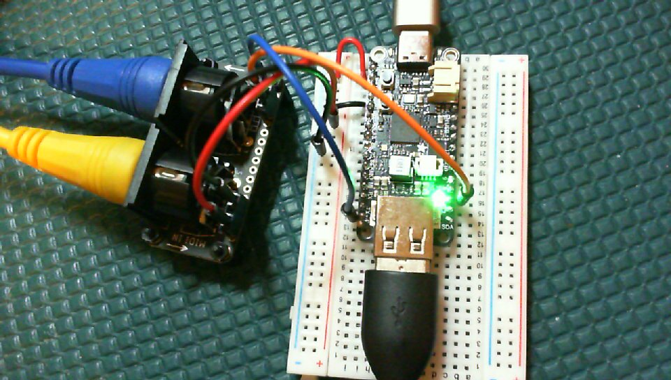

# midi2piousbhost Arduino Sketch

# Hardware
This project uses the RP2040's USB hardware as a USB device to connect
to the Arduino system, It uses the RP2040's PIO0 module to make a USB
Host port. It uses the RP2040's UART1 for the serial MIDI port. Debug prints appear on
the Arduino Serial device. This
software will run on the [Adafruit RP2040 Feather with USB Type A Host](https://learn.adafruit.com/adafruit-feather-rp2040-with-usb-type-a-host)
wired to the [Adafruit MIDI Featherwing board](https://learn.adafruit.com/adafruit-midi-featherwing).


Wire the 3.3V and Ground from the Feather board to the Featherwing Board.
Wire the Featherwing Tx pin to pin D4 of the Feather board.
Wire the Featherwing Rx pin to pin D5 of the Feather board.
Connect the USB C port to the Arduino PC and the USB A port
to your USB MIDI device. Wire MIDI IN and MIDI OUT to your
Serial Port MIDI device.

You do not have to use these two boards to run this sketch.
You can wire something up yourself for less money. Have a look
at the [pico-usb-midi-filter](https://github.com/rppicomidi/pico-usb-midi-filter)
and [pico-pio-midi-processor](https://github.com/rppicomidi/pico-usb-midi-processor) projects for some ideas.
The Adafruit set is very convenient, however.

# License Notes
Code that I have written is released under the MIT License. Some libraries
the Arduino Sketch links to are released under other licenses. The
discussion [here](https://support.arduino.cc/hc/en-us/articles/4415094490770-Licensing-for-products-based-on-Arduino)
may be helpful.

# Software Build and Run
Make sure your Arduino IDE is set up to build software for RP2040 boards.
If you have never used Arduino to build software for the RP2040 chip,
you can find a good tutorial [here](https://learn.adafruit.com/adafruit-feather-rp2040-with-usb-type-a-host/arduino-ide-setup).
You should make sure your Board Manager has installed
verion 3.6.3 or later of the
[Earle Philhower Arduino Core](https://github.com/earlephilhower/arduino-pico/releases/download/global/package_rp2040_index.json).

Once you are able to build and run a simple blink example, please use
the Arduino IDE Library Manager to install the
[usb_midi_host](https://github.com/rppicomidi/usb_midi_host) library and all of its dependencies, plus the [Pico-PIO-USB](https://github.com/sekigon-gonnoc/Pico-PIO-USB) library and all of its dependencies.

Use a web browser to navigate to the [midi2usbhost](https://github.com/rppicomidi/midi2usbhost)
project page. Click the `<> Code` Button and select `Download ZIP`. The browser will download
the file `midi2usbhost-main.zip`. Extract the ZIP file and copy the directory
`midi2usbhost/arduino/midi2piousbhost` to your Sketch directory.

In the Arduino IDE, use `File->Open...` to load the `midi2piousbhost/midi2piousbhost.ino` file.

In the IDE Tools menu, set up the IDE as follows:
```
Tools->CPU Speed->120 MHz (or 240 MHz (Overclock))
Tools->USB Stack->"Adafruit TinyUSB"
Tools->Debug Port->Serial
Tools->Optimize: You can choose any option except Small (-Os) (Standard). I generally use Optimize Even More (-O3)
```

## First time program load
Press and hold the Feather board's reset button. Press and hold the boot button.  Release the reset button. Finally, release the Boot button.
The board will mount like a USB flash drive. Once you have successfully
downloaded a program to the board using the Arduino IDE, you won't
have to go through this step again, even if you change or re-download
the software to the board.

## Running the code
Press the Upload icon in the Arduino IDE. The Sketch should compile and run. The Serial Monitor (115200 baud) should
display
```
Core1 setup to run TinyUSB host with pio-usb            
MIDI To PIO USB Host
```
Plug a USB MIDI device to your target board through the adapter you have.
The LED on the target board should illuminate to show the MIDI device has
enumerated successfully. Also he Serial Monitor should display information
about the MIDI device, and the serial MIDI to USB MIDI bridge should
operate now for MIDI IN and MIDI OUT.

## Always run a serial monitor
The sketch is written to make the board wait for a serial monitor
program to connect to the board before anything else can happen.
If that behavior does not work for you, look for lines similar to
```
  while (!Serial) {
    delay(100);   // wait for native usb
  }
```
and either comment them out or delete them.